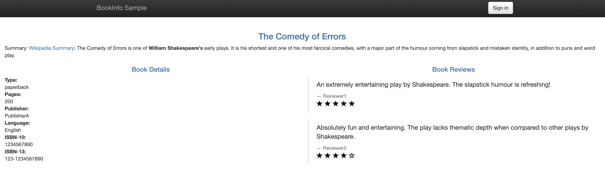

# Deploy Istio using Helm

Cloud platforms provide a wealth of benefits for the organizations that use them.
There’s no denying, however, that adopting the cloud can put strains on DevOps teams.
Developers must use microservices to architect for portability, meanwhile operators are managing extremely large hybrid and multi-cloud deployments.
Istio lets you connect, secure, control, and observe services.

At a high level, Istio helps reduce the complexity of these deployments, and eases the strain on your development teams.
It is a completely open source service mesh that layers transparently onto existing distributed applications.
It is also a platform, including APIs that let it integrate into any logging platform, or telemetry or policy system.
Istio’s diverse feature set lets you successfully, and efficiently, run a distributed microservice architecture, and provides a uniform way to secure, connect, and monitor microservices.

Download the latest release of Istio using the following command:

```bash
curl -L https://git.io/getLatestIstio | ISTIO_VERSION=1.2.2 sh -
```

Run the following commands to go to the Istio directory and to create the Istio CRDs using Helm:

```bash
cd istio*
export PATH=$PWD/bin:$PATH
helm install install/kubernetes/helm/istio-init --name istio-init --namespace istio-system
```

Wait until the 23 CRDs have been created:

```bash
until kubectl get crds | grep 'istio.io\|certmanager.k8s.io' | wc -l | grep 23
do
  sleep 1
done

23
```

Run the following commands to install Istio using Helm:

```bash
helm install install/kubernetes/helm/istio --name istio --namespace istio-system
```

Wait until all the Istio pods are running:

```bash
kubectl -n istio-system get pods

NAME                                      READY   STATUS      RESTARTS   AGE
istio-citadel-68c85b6684-ghp95            1/1     Running     0          3m42s
istio-galley-77d697957f-wfhnx             1/1     Running     0          3m42s
istio-ingressgateway-8b858ff84-mmcm2      1/1     Running     0          3m42s
istio-init-crd-10-l9vkw                   0/1     Completed   0          3m57s
istio-init-crd-11-tk9hf                   0/1     Completed   0          3m57s
istio-init-crd-12-9jrdz                   0/1     Completed   0          3m57s
istio-pilot-5544b58bb6-257nb              2/2     Running     0          3m42s
istio-policy-5f9cf6df57-pgxq7             2/2     Running     3          3m42s
istio-sidecar-injector-66549495d8-gq2kb   1/1     Running     0          3m42s
istio-telemetry-7749c6d54f-g4q25          2/2     Running     2          3m42s
prometheus-776fdf7479-lrwvq               1/1     Running     0          3m42s
```

# Deploy an application on Istio

This example deploys a sample application composed of four separate microservices used to demonstrate various Istio features.
The application displays information about a book, similar to a single catalog entry of an online book store.
Displayed on the page is a description of the book, book details (ISBN, number of pages, and so on), and a few book reviews.

Run the following commands to deploy the bookinfo application:

```bash
kubectl apply -f <(istioctl kube-inject -f samples/bookinfo/platform/kube/bookinfo.yaml)
kubectl apply -f samples/bookinfo/networking/bookinfo-gateway.yaml
```

Finally, run the following command to get the URL of the Load Balancer created on AWS for this service:

```bash
kubectl get svc istio-ingressgateway -n istio-system

NAME                   TYPE           CLUSTER-IP    EXTERNAL-IP                                                               PORT(S)                                                                                                                                      AGE
istio-ingressgateway   LoadBalancer   10.0.29.241   a682d13086ccf11e982140acb7ee21b7-2083182676.us-west-2.elb.amazonaws.com   15020:30380/TCP,80:31380/TCP,443:31390/TCP,31400:31400/TCP,15029:30756/TCP,15030:31420/TCP,15031:31948/TCP,15032:32061/TCP,15443:31232/TCP   110s
```

You need to wait for a few minutes while the Load Balancer is created on AWS and the name resolution in place.

```bash
until nslookup $(kubectl get svc istio-ingressgateway -n istio-system --output jsonpath={.status.loadBalancer.ingress[*].hostname})
do
  sleep 1
done
echo "Open http://$(kubectl get svc istio-ingressgateway -n istio-system --output jsonpath={.status.loadBalancer.ingress[*].hostname})/productpage to access the BookInfo Sample app"
```

Go to the corresponding URL to access the BookInfo Sample app.



You can then follow the other steps described in the Istio documentation to understand the different Istio features:

[https://istio.io/docs/examples/bookinfo/](https://istio.io/docs/examples/bookinfo/)
