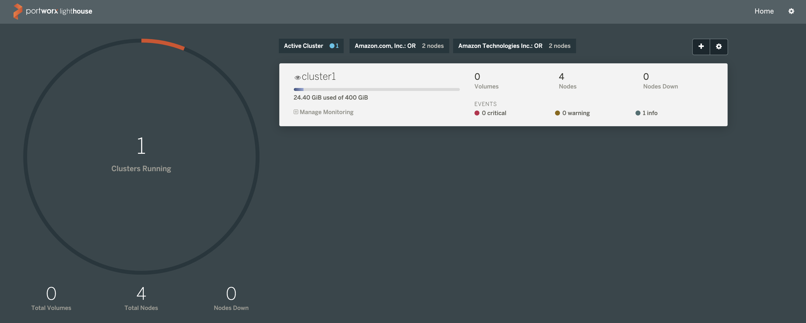

# Leverage persistent storage using Portworx

Portworx is a Software Defined Software that can use the local storage of the DC/OS nodes to provide High Available persistent storage to both Kubernetes pods and DC/OS services.

### Objectives
- Deploy Portworx on your Kubernetes cluster to leverage persistent storage using a kubernetes StorageClass
- Create a PersistentVolumeClaim (pvc) to use volumes created in Portworx
- Create a Pod service that will consume this pvc, write data to the persistent volume, and delete the Pod
- Create a second Pod service that will consume the same pvc and validate that data persisted

### Why is this Important?
In recent years, containerization has become a popular way to bundle applications in a way that can be created and destroyed as often as needed. However, initially the containerization space did not support persistent storage, meaning that the data created within a container would disappear when the app finished its work and the container was destroyed. For many use-cases this is undesirable, and the industry has met the need by providing methods of retaining data created by storing them in persistent volumes. This allows for stateful applications such as databases to remain available even if a container goes down.

Mesosphere provides multiple ways to achieving persistent storage for containerized applications. Portworx has been a partner of Mesosphere for many years and is a leading solution for container-based storage on the market. The Portworx solution is well integrated with Konvoy and the Kubernetes community.

Set the following environment variables:

```bash
export CLUSTER=$(grep -m 1 tags.kubernetes.io/cluster state/terraform.tfstate | awk '{ print $2 }' | cut -d\" -f2)
export REGION=us-west-2
```

Update the `~/.aws/credentials` file with the new information provided by your instructor.

Execute the following commands to create and attach an EBS volume to each Kubelet.

```bash
aws --region="$REGION" ec2 describe-instances |  jq --raw-output ".Reservations[].Instances[] | select((.Tags | length) > 0) | select(.Tags[].Value | test(\"$CLUSTER-worker\")) | select(.State.Name | test(\"running\")) | [.InstanceId, .Placement.AvailabilityZone] | \"\(.[0]) \(.[1])\"" | while read -r instance zone; do
  echo "$instance" "$zone"
  volume=$(aws --region="$REGION" ec2 create-volume --size=100  --availability-zone="$zone" --tag-specifications="ResourceType=volume,Tags=[{Key=string,Value=$CLUSTER}]" | jq --raw-output .VolumeId)
  sleep 10
  aws --region=$REGION ec2 attach-volume --device=/dev/xvdc --instance-id="$instance" --volume-id="$volume"
done
```

To be able to use Portworx persistent storage on your Kubernetes cluster, you need to download the Portworx specs using the following command:

```bash
wget -O portworx.yaml "https://install.portworx.com/?mc=false&kbver=1.15.1&b=true&stork=true&lh=true&st=k8s&c=cluster1"
```

Then, you need to edit the `portworx.yaml` file to modify the type of the Kubernetes Service from `NodePort` to `LoadBalancer`:

```
apiVersion: v1
kind: Service
metadata:
  name: px-lighthouse
  namespace: kube-system
  labels:
    tier: px-web-console
spec:
  type: LoadBalancer
  ports:
    - name: http
      port: 80
      targetPort: 80
    - name: https
      port: 443
      targetPort: https
  selector:
    tier: px-web-console
```

Now, you can deploy Portworx using the command below:

```bash
kubectl apply -f portworx.yaml
```

Run the following command until all the pods are running:

```bash
kubectl -n kube-system get pods
```

You need to wait for a few minutes while the Load Balancer is created on AWS and the name resolution in place.

```bash
until nslookup $(kubectl -n kube-system get svc px-lighthouse --output jsonpath={.status.loadBalancer.ingress[*].hostname})
do
  sleep 1
done
echo "Open http://$(kubectl -n kube-system get svc px-lighthouse --output jsonpath={.status.loadBalancer.ingress[*].hostname}) to access the Portworx UI"
```

Access the Portworx UI using the URL indicated and login with the user `admin` and the password `Password1`.



Create the Kubernetes StorageClass using the following command:

```bash
cat <<EOF | kubectl create -f -
kind: StorageClass
apiVersion: storage.k8s.io/v1beta1
metadata:
   name: portworx-sc
provisioner: kubernetes.io/portworx-volume
parameters:
  repl: "2"
EOF
```

It will create volumes on Portworx with 2 replicas.

Create the Kubernetes PersistentVolumeClaim using the following command:

```bash
cat <<EOF | kubectl create -f -
kind: PersistentVolumeClaim
apiVersion: v1
metadata:
  name: pvc001
  annotations:
    volume.beta.kubernetes.io/storage-class: portworx-sc
spec:
  accessModes:
    - ReadWriteOnce
  storageClassName: portworx-sc
  resources:
    requests:
      storage: 1Gi
EOF
```

Check the status of the PersistentVolumeClaim using the following command:

```bash
kubectl describe pvc pvc001
Name:          pvc001
Namespace:     default
StorageClass:  portworx-sc
Status:        Bound
Volume:        pvc-a38e5d2c-7df9-11e9-b547-0ac418899022
Labels:        <none>
Annotations:   pv.kubernetes.io/bind-completed: yes
               pv.kubernetes.io/bound-by-controller: yes
               volume.beta.kubernetes.io/storage-class: portworx-sc
               volume.beta.kubernetes.io/storage-provisioner: kubernetes.io/portworx-volume
Finalizers:    [kubernetes.io/pvc-protection]
Capacity:      1Gi
Access Modes:  RWO
VolumeMode:    Filesystem
Events:
  Type       Reason                 Age   From                         Message
  ----       ------                 ----  ----                         -------
  Normal     ProvisioningSucceeded  12s   persistentvolume-controller  Successfully provisioned volume pvc-a38e5d2c-7df9-11e9-b547-0ac418899022 using kubernetes.io/portworx-volume
Mounted By:  <none>
```

Create a Kubernetes Pod that will use this PersistentVolumeClaim using the following command:

```bash
cat <<EOF | kubectl create -f -
apiVersion: v1
kind: Pod
metadata:
  name: pvpod
spec:
  containers:
  - name: test-container
    image: alpine:latest
    command: [ "/bin/sh" ]
    args: [ "-c", "while true; do sleep 60;done" ]
    volumeMounts:
    - name: test-volume
      mountPath: /test-portworx-volume
  volumes:
  - name: test-volume
    persistentVolumeClaim:
      claimName: pvc001
EOF
```

Create a file in the Volume using the following commands:

```bash
kubectl exec -i pvpod -- /bin/sh -c "echo test > /test-portworx-volume/test"
```

Delete the Pod using the following command:

```bash
kubectl delete pod pvpod
```

Create a Kubernetes Pod that will use the same PersistentVolumeClaim using the following command:

```bash
cat <<EOF | kubectl create -f -
apiVersion: v1
kind: Pod
metadata:
  name: pvpod
spec:
  containers:
  - name: test-container
    image: alpine:latest
    command: [ "/bin/sh" ]
    args: [ "-c", "while true; do sleep 60;done" ]
    volumeMounts:
    - name: test-volume
      mountPath: /test-portworx-volume
  volumes:
  - name: test-volume
    persistentVolumeClaim:
      claimName: pvc001
EOF
```

Validate that the file created in the previous Pod is still available:

```bash
kubectl exec -i pvpod cat /test-portworx-volume/test
```
