# Konvoy training

## Introduction

During this training, you'll learn how to deploy Konvoy and to use its main features:

* [Introduction](#introduction)
* [Prerequisites](#prerequisites)
* [1. Deploy a Konvoy cluster](#1-deploy-a-konvoy-cluster)
* [2. Expose a Kubernetes Application using a Service Type Load Balancer (L4)](#2-expose-a-kubernetes-application-using-a-service-type-load-balancer-l4)
* [3. Expose a Kubernetes Application using an Ingress (L7)](#3-expose-a-kubernetes-application-using-an-ingress-l7)
* [4. Leverage Network Policies to restrict access](#4-leverage-network-policies-to-restrict-access)
* [5. Leverage persistent storage using CSI](#5-leverage-persistent-storage-using-csi)
* [6. Deploy Jenkins using Helm](#6-deploy-jenkins-using-helm)
* [7. Deploy Apache Kafka using KUDO](#7-deploy-apache-kafka-using-kudo)
* [8. Scale a Konvoy cluster](#8-scale-a-konvoy-cluster)
* [9. Konvoy monitoring](#9-konvoy-monitoring)
* [10. Konvoy logging/debugging](#10-konvoy-loggingdebugging)
* [11. Upgrade a Konvoy cluster](#11-upgrade-a-konvoy-cluster)
* [12. Destroy a Konvoy cluster](#12-destroy-a-konvoy-cluster)
* [Appendix 1. Setting up an external identity provider](#appendix-1-setting-up-an-external-identity-provider)

## Prerequisites

You need either a Linux, MacOS or a Windows laptop.


## Jumpserver

Jumpservers have been deployed for each student with all prerequisites installed. First, go to the student data spreadsheet and select a host by entering your name.  Then, download the ssh-private-key (id_rsa_student#) and change the file permissions.  Finally, ssh to the ipaddress of your assigned jumpserver using the -i option to specify the identity file to be used.  The username for the Jumpserver is "centos".

For Mac and Linux clients you must change the permission on the file.
```
chmod 400 id_rsa_student#
```
```
ssh -i id_rsa_student# centos@jumpserver-ip-address
```


>For Windows, you need to use the [Google Cloud Shell](https://console.cloud.google.com/cloudshell).
Once your Google Cloud Shell has started, you will have to copy the contents of you id_rsa_student#.pem file to a local file in the cloud shell.  Then change the permission on the file and ssh into the jump host.


```
vi id_rsa_student#
```
```
chmod 400 id_rsa_student#
```
```
ssh -i id_rsa_student# centos@jumpserver-ip-address
```

## 1. Deploy a Konvoy cluster

### Objectives
- Deploy a Kubernetes cluster with all the addons you need to get a production ready container orchestration platform
- Configure kubectl to manage your cluster

### Why is this Important?
There are many ways to deploy a kubernetes cluster from a fully manual procedure to using a fully automated or opinionated SaaS. Cluster sizes can also widely vary from a single node deployment on your laptop, to thousands of nodes in a single logical cluster, or even across multiple clusters. Thus, picking a deployment model that suits the scale that you need as your business grows is important.


Change directories into the lab directory:

```
cd ~/lab
```

Deploy your cluster using the command below:

```bash
konvoy up --yes
```

The output should be similar to:

```                                                                
This process will take about 15 minutes to complete (additional time may be required for larger clusters), do you want to continue [y/n]: y

STAGE [Provisioning Infrastructure]

Initializing provider plugins...

...

Terraform has been successfully initialized!

...

STAGE [Deploying Enabled Addons]
helm                                                                   [OK]
dashboard                                                              [OK]
fluentbit                                                              [OK]
awsebscsiprovisioner                                                   [OK]
traefik                                                                [OK]
opsportal                                                              [OK]
kommander                                                              [OK]
prometheus                                                             [OK]
elasticsearch                                                          [OK]
dex                                                                    [OK]
elasticsearchexporter                                                  [OK]
kibana                                                                 [OK]
traefik-forward-auth                                                   [OK]
prometheusadapter                                                      [OK]
dex-k8s-authenticator                                                  [OK]
velero                                                                 [OK]

STAGE [Removing Disabled Addons]

Kubernetes cluster and addons deployed successfully!

Run `konvoy apply kubeconfig` to update kubectl credentials.

Navigate to the URL below to access various services running in the cluster.
  https://a7e039f1a05a54f45b36e063f5aee077-287582892.us-west-2.elb.amazonaws.com/ops/landing
And login using the credentials below.
  Username: goofy_einstein
  Password: tUeARRKxM8PfrIy2cjFc1jI0Hr2I0duzlttr1LzRTKoDooQJ0d1yyutjNv4NLHvy

If the cluster was recently created, the dashboard and services may take a few minutes to be accessible.
```

If you get any error during the deployment of the addons (it can happen with network connectivity issues), then, you can run the following command to redeploy them:

```
konvoy deploy addons --yes
```

As soon as your cluster is successfully deployed, the URL and the credentials to access your cluster are displayed. When you lauch your dashboard URL in your browser the first screen will ask you to select "login or generate token", select login and use the credentials provided.

If you need to get this information later, you can execute the command below:
```bash
konvoy get ops-portal
```

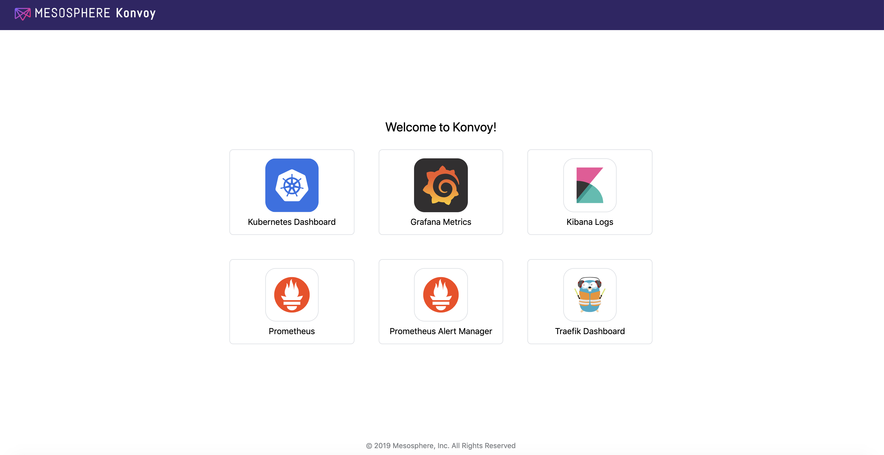

Click on the `Kubernetes Dashboard` icon to open it.

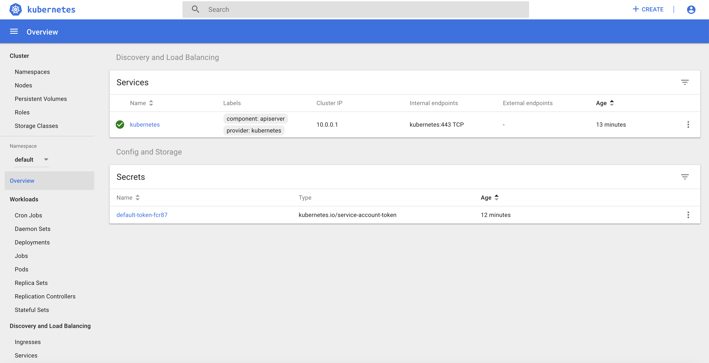

To configure kubectl to manage your cluster, you simply need to run the following command:

```
konvoy apply kubeconfig
```

You can check that the Kubernetes cluster has been deployed using the version `1.15.2` with 3 control nodes and 5 workers nodes

```bash
kubectl get nodes
```
The output should be similar to:
```bash
NAME                                         STATUS   ROLES    AGE   VERSION
ip-10-0-128-64.us-west-2.compute.internal    Ready    <none>   10m   v1.15.2
ip-10-0-129-247.us-west-2.compute.internal   Ready    <none>   10m   v1.15.2
ip-10-0-129-41.us-west-2.compute.internal    Ready    <none>   10m   v1.15.2
ip-10-0-129-88.us-west-2.compute.internal    Ready    <none>   10m   v1.15.2
ip-10-0-130-84.us-west-2.compute.internal    Ready    <none>   10m   v1.15.2
ip-10-0-193-118.us-west-2.compute.internal   Ready    master   11m   v1.15.2
ip-10-0-193-232.us-west-2.compute.internal   Ready    master   12m   v1.15.2
ip-10-0-194-21.us-west-2.compute.internal    Ready    master   13m   v1.15.2
```

## 2. Expose a Kubernetes Application using a Service Type Load Balancer (L4)

### Objectives
- Deploy a Redis pod and expose it using a Service Type Load Balancer (L4) and validate that the connection is exposed to the outside
- Deploy a couple hello-world applications and expose them using an Ingress service (L7) and validate that the connection is exposed to the outside

### Why is this Important?
Exposing your application on a kubernetes cluster in an Enterprise-grade environment can be challenging to set up. With Konvoy, the integration with AWS cloud load balancer is already done by default and Traefik is deployed to allow you to easily create Ingresses.

Deploy a redis Pod on your Kubernetes cluster running the following command:

```bash
cat <<EOF | kubectl create -f -
apiVersion: v1
kind: Pod
metadata:
  labels:
    app: redis
  name: redis
spec:
  containers:
  - name: redis
    image: redis:5.0.3
    ports:
    - name: redis
      containerPort: 6379
      protocol: TCP
EOF
```

Then, expose the service, you need to run the following command to create a Service Type Load Balancer:

```bash
cat <<EOF | kubectl create -f -
apiVersion: v1
kind: Service
metadata:
  labels:
    app: redis
  name: redis
spec:
  type: LoadBalancer
  selector:
    app: redis
  ports:
  - protocol: TCP
    port: 6379
    targetPort: 6379
EOF
```

Finally, run the following command to see the URL of the Load Balancer created on AWS for this service:

```bash
kubectl get svc redis

The output should be similar to:
```bash
NAME    TYPE           CLUSTER-IP   EXTERNAL-IP                                                               PORT(S)          AGE
redis   LoadBalancer   10.0.51.32   a92b6c9216ccc11e982140acb7ee21b7-1453813785.us-west-2.elb.amazonaws.com   6379:31423/TCP   43s
```

You need to wait for a few minutes while the Load Balancer is created on AWS and the name resolution in place.

```bash
until nslookup $(kubectl get svc redis --output jsonpath={.status.loadBalancer.ingress[*].hostname})
do
  sleep 1
done
```

You can validate that you can access the redis Pod from your laptop using telnet:

```bash
telnet $(kubectl get svc redis --output jsonpath={.status.loadBalancer.ingress[*].hostname}) 6379
```

The output should be similar to:
```bash
Trying 52.27.218.48...
Connected to a92b6c9216ccc11e982140acb7ee21b7-1453813785.us-west-2.elb.amazonaws.com.
Escape character is '^]'.
quit
+OK
Connection closed by foreign host.
```

If you don't have `telnet` installed in your machine, you can use `nc` instead.

## 3. Expose a Kubernetes Application using an Ingress (L7)

Deploy 2 web application Pods on your Kubernetes cluster running the following command:

```bash
kubectl run --restart=Never --image hashicorp/http-echo --labels app=http-echo-1 --port 80 http-echo-1 -- -listen=:80 --text="Hello from http-echo-1"
kubectl run --restart=Never --image hashicorp/http-echo --labels app=http-echo-2 --port 80 http-echo-2 -- -listen=:80 --text="Hello from http-echo-2"
```

Then, expose the Pods with a Service Type NodePort using the following commands:

```bash
kubectl expose pod http-echo-1 --port 80 --target-port 80 --type NodePort --name "http-echo-1"
kubectl expose pod http-echo-2 --port 80 --target-port 80 --type NodePort --name "http-echo-2"
```

Finally create the Ingress to expose the application to the outside world using the following command:

```bash
cat <<EOF | kubectl create -f -
apiVersion: extensions/v1beta1
kind: Ingress
metadata:
  name: echo
spec:
  rules:
  - host: "http-echo-1.com"
    http:
      paths:
      - backend:
          serviceName: http-echo-1
          servicePort: 80
  - host: "http-echo-2.com"
    http:
      paths:
      - backend:
          serviceName: http-echo-2
          servicePort: 80
EOF
```

Go to the Traefik UI to check that new frontends have been created.

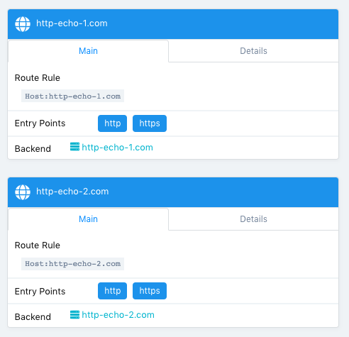

Finally, run the following command to see the URL of the Load Balancer created on AWS for the Traefik service:

```bash
kubectl get svc traefik-kubeaddons -n kubeaddons
```

The output should be similar to:
```bash
NAME                 TYPE           CLUSTER-IP    EXTERNAL-IP                                                             PORT(S)                                     AGE
traefik-kubeaddons   LoadBalancer   10.0.24.215   abf2e5bda6ca811e982140acb7ee21b7-37522315.us-west-2.elb.amazonaws.com   80:31169/TCP,443:32297/TCP,8080:31923/TCP   4h22m
```

You can validate that you can access the web application Pods from your laptop using the following commands:

```bash
curl -k -H "Host: http-echo-1.com" https://$(kubectl get svc traefik-kubeaddons -n kubeaddons --output jsonpath={.status.loadBalancer.ingress[*].hostname})
curl -k -H "Host: http-echo-2.com" https://$(kubectl get svc traefik-kubeaddons -n kubeaddons --output jsonpath={.status.loadBalancer.ingress[*].hostname})
```

You can also set some Traefik annotations to use some advanced features as described in this [document](https://docs.traefik.io/providers/kubernetes-crd/).

## 4. Leverage Network Policies to restrict access

By default, all the pods can access all the services inside and outside the Kubernetes clusters and services exposed to the external world can be accessed by anyone. Kubernetes Network Policies can be used to restrict access.

When a Kubernetes cluster is deployed by Konvoy, a Calico cluster is automatically deployed on this cluster. It allows a user to define network policies without any additional configuration.

### Objectives
- Create a network policy to deny any ingress
- Check that the Redis and the http-echo apps aren't accessible anymore
- Create network policies to allow ingress access to these apps only
- Check that the Redis and the http-echo apps are now accessible

### Why is this Important?
In many cases, you want to restrict communications between services. For example, you often want some micro services to be reachable only other specific micro services.

In this lab, we restrict access to ingresses, so you may think that it's useless as we can simply not expose these apps if we want to restrict access. But, in fact, it makes sense to also create network policies to avoid cases where an app is exposed by mistake.

Create a network policy to deny any ingress

```bash
cat <<EOF | kubectl create -f -
apiVersion: networking.k8s.io/v1
kind: NetworkPolicy
metadata:
  name: default-deny
spec:
  podSelector: {}
  policyTypes:
  - Ingress
EOF
```

Wait for a minute to allow the network policy to be activated and check that the Redis and the http-echo apps aren't accessible anymore

```bash
telnet $(kubectl get svc redis --output jsonpath={.status.loadBalancer.ingress[*].hostname}) 6379
```

```bash
curl -k -H "Host: http-echo-1.com" https://$(kubectl get svc traefik-kubeaddons -n kubeaddons --output jsonpath={.status.loadBalancer.ingress[*].hostname})
curl -k -H "Host: http-echo-2.com" https://$(kubectl get svc traefik-kubeaddons -n kubeaddons --output jsonpath={.status.loadBalancer.ingress[*].hostname})
```

Create network policies to allow ingress access to these apps only

```bash
cat <<EOF | kubectl create -f -
kind: NetworkPolicy
apiVersion: networking.k8s.io/v1
metadata:
  name: access-redis
spec:
  podSelector:
    matchLabels:
      app: redis
  ingress:
  - from: []
EOF

cat <<EOF | kubectl create -f -
kind: NetworkPolicy
apiVersion: networking.k8s.io/v1
metadata:
  name: access-http-echo-1
spec:
  podSelector:
    matchLabels:
      app: http-echo-1
  ingress:
  - from: []
EOF

cat <<EOF | kubectl create -f -
kind: NetworkPolicy
apiVersion: networking.k8s.io/v1
metadata:
  name: access-http-echo-2
spec:
  podSelector:
    matchLabels:
      app: http-echo-2
  ingress:
  - from: []
EOF
```

Wait for a minute and check that the Redis and the http-echo apps are now accessible

```bash
telnet $(kubectl get svc redis --output jsonpath={.status.loadBalancer.ingress[*].hostname}) 6379
```

```bash
curl -k -H "Host: http-echo-1.com" https://$(kubectl get svc traefik-kubeaddons -n kubeaddons --output jsonpath={.status.loadBalancer.ingress[*].hostname})
curl -k -H "Host: http-echo-2.com" https://$(kubectl get svc traefik-kubeaddons -n kubeaddons --output jsonpath={.status.loadBalancer.ingress[*].hostname})
```

Delete the network policy that denies any ingress

```bash
cat <<EOF | kubectl delete -f -
apiVersion: networking.k8s.io/v1
kind: NetworkPolicy
metadata:
  name: default-deny
spec:
  podSelector: {}
  policyTypes:
  - Ingress
EOF
```

## 5. Leverage persistent storage using CSI

### Objectives
- Create a PersistentVolumeClaim (pvc) to use the AWS EBS CSI driver
- Create a service that will use this PVC and dynamically provision an EBS volume
- Validate persistence

### Why is this Important?
The goal of CSI is to establish a standardized mechanism for Container Orchestration Systems to expose arbitrary storage systems to their containerized workloads. The CSI specification emerged from cooperation between community members from various Container Orchestration Systems including Kubernetes, Mesos, Docker, and Cloud Foundry.

By creating an industry standard interface, the CSI initiative sets ground rules in order to minimize user confusion. By providing a pluggable standardized interface, the community will be able to adopt and maintain new CSI-enabled storage drivers to their kubernetes clusters as they mature. Choosing a solution that supports CSI integration will allow your business to adopt the latest and greatest storage solutions with ease.

When Konvoy is deployed on AWS, a `StorageClass` is created automatically as you can see below:

```
kubectl get sc awsebscsiprovisioner -o yaml
```

The output should be similar to:
```bash
apiVersion: storage.k8s.io/v1
kind: StorageClass
metadata:
  annotations:
    kubernetes.io/description: AWS EBS CSI provisioner StorageClass
    storageclass.kubernetes.io/is-default-class: "true"
  creationTimestamp: "2019-08-12T10:43:23Z"
  name: awsebscsiprovisioner
  resourceVersion: "1573"
  selfLink: /apis/storage.k8s.io/v1/storageclasses/awsebscsiprovisioner
  uid: 413745a0-ec52-4917-afb5-70bdf8f2a606
parameters:
  type: gp2
provisioner: ebs.csi.aws.com
reclaimPolicy: Delete
volumeBindingMode: WaitForFirstConsumer
```

Create the Kubernetes PersistentVolumeClaim using the following command:

```bash
cat <<EOF | kubectl create -f -
apiVersion: v1
kind: PersistentVolumeClaim
metadata:
  name: dynamic
spec:
  accessModes:
    - ReadWriteOnce
  storageClassName: awsebscsiprovisioner
  resources:
    requests:
      storage: 1Gi
EOF
```

Run the following command to check the status of the `PersistentVolumeClaim`:

```bash
kubectl describe pvc dynamic
```

The output should be similar to:
```bash
Name:          dynamic
Namespace:     default
StorageClass:  awsebscsiprovisioner
Status:        Pending
Volume:        
Labels:        <none>
Annotations:   <none>
Finalizers:    [kubernetes.io/pvc-protection]
Capacity:      
Access Modes:  
VolumeMode:    Filesystem
Events:
  Type       Reason                Age               From                         Message
  ----       ------                ----              ----                         -------
  Normal     WaitForFirstConsumer  3s (x3 over 21s)  persistentvolume-controller  waiting for first consumer to be created before binding
Mounted By:  <none>
```

As you can see, it is waiting for a `Pod` to use it to provision the AWS EBS volume.

Create a Kubernetes Deployment that will use this `PersistentVolumeClaim` using the following command:

```bash
cat <<EOF | kubectl create -f -
apiVersion: apps/v1
kind: Deployment
metadata:
  name: ebs-dynamic-app
  labels:
    app: ebs-dynamic-app
spec:
  replicas: 1
  selector:
    matchLabels:
      app: ebs-dynamic-app
  template:
    metadata:
      labels:
        app: ebs-dynamic-app
    spec:
      containers:
      - name: ebs-dynamic-app
        image: centos:7
        command: ["/bin/sh"]
        args: ["-c", "while true; do echo \$(date -u) >> /data/out.txt; sleep 5; done"]
        volumeMounts:
        - name: persistent-storage
          mountPath: /data
      volumes:
      - name: persistent-storage
        persistentVolumeClaim:
          claimName: dynamic
EOF
```

Run the following command until the pod is running:

```bash
kubectl get pods
```

Check the content of the file `/data/out.txt` and note the first timestamp:

```bash
pod=$(kubectl get pods | grep ebs-dynamic-app | awk '{ print $1 }')
kubectl exec -i $pod cat /data/out.txt
```

Delete the Pod using the following command (it will take some time to complete):

```bash
kubectl delete pod $pod
```

The Deployment will recreate the pod automatically.

Run the following command until the pod is running:

```bash
kubectl get pods
```

Check the content of the file `/data/out.txt` and verify that the first timestamp is the same as the one noted previously:

```bash
pod=$(kubectl get pods | grep ebs-dynamic-app | awk '{ print $1 }')
kubectl exec -i $pod cat /data/out.txt
```

## 6. Deploy Jenkins using Helm

Helm is a tool for managing Kubernetes charts. Charts are packages of pre-configured Kubernetes resources.

You can find many charts on the [Helm Hub](https://hub.helm.sh/).

In this lab, we'll deploy the [Jenkins Helm chart](https://hub.helm.sh/charts/stable/jenkins).

To deploy the chart, you need to run the following command:

```bash
helm install stable/jenkins --name jenkins --version 1.5.0 --set master.adminPassword=password
```

The output should be similar to:
```bash
NAME:   jenkins
LAST DEPLOYED: Wed Aug  7 17:21:32 2019
NAMESPACE: default
STATUS: DEPLOYED

RESOURCES:
==> v1/ConfigMap
NAME           DATA  AGE
jenkins        5     1s
jenkins-tests  1     1s

==> v1/Deployment
NAME     READY  UP-TO-DATE  AVAILABLE  AGE
jenkins  0/1    1           0          1s

==> v1/PersistentVolumeClaim
NAME     STATUS   VOLUME                CAPACITY  ACCESS MODES  STORAGECLASS  AGE
jenkins  Pending  awsebscsiprovisioner  1s

==> v1/Pod(related)
NAME                     READY  STATUS   RESTARTS  AGE
jenkins-c79f457cb-ccttb  0/1    Pending  0         1s

==> v1/Role
NAME                     AGE
jenkins-schedule-agents  1s

==> v1/RoleBinding
NAME                     AGE
jenkins-schedule-agents  1s

==> v1/Secret
NAME     TYPE    DATA  AGE
jenkins  Opaque  2     1s

==> v1/Service
NAME           TYPE          CLUSTER-IP  EXTERNAL-IP  PORT(S)         AGE
jenkins        LoadBalancer  10.0.9.26   <pending>    8080:30323/TCP  1s
jenkins-agent  ClusterIP     10.0.41.64  <none>       50000/TCP       1s

==> v1/ServiceAccount
NAME     SECRETS  AGE
jenkins  1        1s
```

Then, run the following command to get the URL of the Load Balancer created on AWS for this service:

```bash
kubectl get svc jenkins
```

The output should be similar to:
```bash
NAME      TYPE           CLUSTER-IP   EXTERNAL-IP                                                              PORT(S)          AGE
jenkins   LoadBalancer   10.0.9.26    a71b8025991124a90b2babf7ba2a75da-492974167.us-west-2.elb.amazonaws.com   8080:30323/TCP   16m
```

You need to wait for a few minutes while the Load Balancer is created on AWS and the name resolution in place.

```bash
until nslookup $(kubectl get svc jenkins --output jsonpath={.status.loadBalancer.ingress[*].hostname})
do
  sleep 1
done
echo "Open http://$(kubectl get svc jenkins --output jsonpath={.status.loadBalancer.ingress[*].hostname}):8080 to access the Jenkins UI"
```

Go to the URL displayed to access Jenkins.

Login with the user `admin` and the password `password`.

## 7. Deploy Apache Kafka using KUDO

The Kubernetes Universal Declarative Operator (KUDO) is a highly productive toolkit for writing operators for Kubernetes. Using KUDO, you can deploy your applications, give your users the tools they need to operate it, and understand how it's behaving in their environments — all without a PhD in Kubernetes.


Install the KUDO CLI (on Linux):

```bash
wget https://github.com/kudobuilder/kudo/releases/download/v0.8.0/kubectl-kudo_0.8.0_linux_x86_64
sudo mv kubectl-kudo_0.8.0_linux_x86_64 /usr/local/bin/kubectl-kudo
chmod +x /usr/local/bin/kubectl-kudo
```

Run the following commands to deploy KUDO on your Kubernetes cluster:

```bash
kubectl kudo init
```

The output should be similar to:
```bash

$KUDO_HOME has been configured at /home/centos/.kudo.
```

Check the status of the KUDO controller:

```bash
kubectl get pods -n kudo-system
```

The output should be similar to:
```bash
NAME                        READY   STATUS    RESTARTS   AGE
kudo-controller-manager-0   1/1     Running   0          84s
```

Deploy ZooKeeper using KUDO:

```bash
kubectl kudo install zookeeper --instance=zk
```

The output should be similar to:
```bash
operator.kudo.dev/v1beta1/zookeeper created
operatorversion.kudo.dev/v1beta1/zookeeper-0.2.0 created
instance.kudo.dev/v1beta1/zk created
```

Check the status of the deployment:

```bash
kubectl kudo plan status --instance=zk
```

The output should be similar to:
```bash
Plan(s) for "zk" in namespace "default":
.
└── zk (Operator-Version: "zookeeper-0.2.0" Active-Plan: "deploy")
    ├── Plan deploy (serial strategy) [COMPLETE]
    │   ├── Phase zookeeper [COMPLETE]
    │   │   └── Step deploy (COMPLETE)
    │   └── Phase validation [COMPLETE]
    │       ├── Step validation (COMPLETE)
    │       └── Step cleanup (COMPLETE)
    └── Plan validation (serial strategy) [NOT ACTIVE]
        └── Phase connection (serial strategy) [NOT ACTIVE]
            └── Step connection (serial strategy) [NOT ACTIVE]
                ├── connection [NOT ACTIVE]
                └── cleanup [NOT ACTIVE]
```

And check that the corresponding Pods are running:

```bash
kubectl get pods | grep zk
```

The output should be similar to:
```bash
zk-zookeeper-0                         1/1     Running   0          21m
zk-zookeeper-1                         1/1     Running   0          21m
zk-zookeeper-2                         1/1     Running   0          21m
```

Deploy Kafka 2.2.1 using KUDO (the version of the KUDO Kafka operator is 0.1.3):

```bash
kubectl kudo install kafka --instance=kafka -p ZOOKEEPER_URI=zk-zookeeper-0.zk-hs:2181,zk-zookeeper-1.zk-hs:2181,zk-zookeeper-2.zk-hs:2181 --version=0.1.3
```

Check the status of the deployment:

```bash
kubectl kudo plan status --instance=kafka
```

The output should be similar to:
```bash
Plan(s) for "kafka" in namespace "default":
.
└── kafka (Operator-Version: "kafka-0.1.3" Active-Plan: "deploy")
    ├── Plan deploy (serial strategy) [COMPLETE]
    │   └── Phase deploy-kafka [COMPLETE]
    │       └── Step deploy (COMPLETE)
    └── Plan not-allowed (serial strategy) [NOT ACTIVE]
        └── Phase not-allowed (serial strategy) [NOT ACTIVE]
            └── Step not-allowed (serial strategy) [NOT ACTIVE]
                └── not-allowed [NOT ACTIVE]
```

And check that the corresponding Pods are running:

```bash
kubectl get pods | grep kafka
```

The output should be similar to:
```bash
kafka-kafka-0                          1/1     Running   0          39s
kafka-kafka-1                          1/1     Running   0          58s
kafka-kafka-2                          1/1     Running   0          118s
```

Produce messages in Kafka:

```bash
cat <<EOF | kubectl create -f -
apiVersion: apps/v1beta1
kind: Deployment
metadata:
  name: kudo-kafka-generator
spec:
  replicas: 1
  template:
    metadata:
      name: kudo-kafka-generator
      labels:
        app: kudo-kafka-generator
    spec:
      containers:
      - name: kudo-kafka-generator
        image: mesosphere/flink-generator:0.1
        command: ["/generator-linux"]
        imagePullPolicy: Always
        args: ["--broker", "kafka-kafka-0.kafka-svc:9092"]
EOF
```

Consume messages from Kafka:

```bash
cat <<EOF | kubectl create -f -
apiVersion: apps/v1beta1
kind: Deployment
metadata:
 name: kudo-kafka-consumer
spec:
 replicas: 1
 template:
   metadata:
     name: kudo-kafka-consumer
     labels:
       app: kudo-kafka-consumer
   spec:
     containers:
     - name: kudo-kafka-consumer
       image: tbaums/kudo-kafka-demo
       imagePullPolicy: Always
       env:
        - name: BROKER_SERVICE
          value: kafka-kafka-0.kafka-svc:9092
EOF
```

Check the logs:

```bash
kubectl logs $(kubectl get pods -l app=kudo-kafka-consumer -o jsonpath='{.items[0].metadata.name}') --follow
```

The output should be similar to:
```bash
Message: b'2019-11-12T12:23:19Z;3;4;1071'
Message: b'2019-11-12T12:23:21Z;4;3;3095'
Message: b'2019-11-12T12:23:22Z;3;7;8639'
Message: b'2019-11-12T12:23:27Z;9;4;7861'
Message: b'2019-11-12T12:23:30Z;7;5;3594'
Message: b'2019-11-12T12:23:33Z;5;0;9985'
```

KUDO is creating CRDs (new objects) in Kubernetes and you can get information about these objects like you can get informations about pods, deployments, ...

Run this command to get the list of CRDs created by KUDO:

```bash
kubectl get crds | grep kudo
```

The output should be similar to:
```bash
instances.kudo.dev                               2019-11-12T12:16:19Z
operators.kudo.dev                               2019-11-12T12:16:19Z
operatorversions.kudo.dev                        2019-11-12T12:16:19Z
```

Now list the KUDO instances running using the following command:

```bash
kubectl get instances.kudo.dev
```

The output should be similar to:
```bash
NAME    AGE
kafka   18m
zk      33m
```

And get information about the KUDO Kafka instance:

```bash
kubectl get instances.kudo.dev kafka -o yaml
```

The output should be similar to:
```bash
apiVersion: kudo.dev/v1beta1
kind: Instance
metadata:
  annotations:
    kudo.dev/last-applied-instance-state: '{"operatorVersion":{"name":"kafka-0.1.3"},"parameters":{"ZOOKEEPER_URI":"zk-zookeeper-0.zk-hs:2181,zk-zookeeper-1.zk-hs:2181,zk-zookeeper-2.zk-hs:2181"}}'
  creationTimestamp: "2019-11-12T12:46:39Z"
  generation: 3
  labels:
    controller-tools.k8s.io: "1.0"
    kudo.dev/operator: kafka
  name: kafka
  namespace: default
  resourceVersion: "81847"
  selfLink: /apis/kudo.dev/v1beta1/namespaces/default/instances/kafka
  uid: 6f289e56-86e7-40d2-8360-f8255678a801
spec:
  operatorVersion:
    name: kafka-0.1.3
  parameters:
    ZOOKEEPER_URI: zk-zookeeper-0.zk-hs:2181,zk-zookeeper-1.zk-hs:2181,zk-zookeeper-2.zk-hs:2181
status:
  aggregatedStatus:
    status: COMPLETE
  planStatus:
    deploy:
      lastFinishedRun: "2019-11-12T12:47:57Z"
      name: deploy
      phases:
      - name: deploy-kafka
        status: COMPLETE
        steps:
        - name: deploy
          status: COMPLETE
      status: COMPLETE
      uid: e0ba11bf-d2d5-467b-b96c-c443aa0ba5ef
    not-allowed:
      lastFinishedRun: null
      name: not-allowed
      phases:
      - name: not-allowed
        status: NEVER_RUN
        steps:
        - name: not-allowed
          status: NEVER_RUN
      status: NEVER_RUN
```

This is also the approach you take to delete a running instance (`kubectl delete instances.kudo.dev kafka`), but you can keep it running.

Upgrade your Kafka cluster to 2.3.0 (the version of the KUDO Kafka operator is 1.0.0) using the following command:

```bash
kubectl kudo upgrade kafka --version=1.0.0 --instance kafka
```

The output should be similar to:
```bash
instance./kafka updated
```

Check the status of the upgrade:

```bash
kubectl kudo plan status --instance=kafka
```

The output should be similar to:
```bash
Plan(s) for "kafka" in namespace "default":
.
└── kafka (Operator-Version: "kafka-1.0.0" Active-Plan: "deploy")
    ├── Plan deploy (serial strategy) [COMPLETE]
    │   └── Phase deploy-kafka [COMPLETE]
    │       └── Step deploy (COMPLETE)
    └── Plan not-allowed (serial strategy) [NOT ACTIVE]
        └── Phase not-allowed (serial strategy) [NOT ACTIVE]
            └── Step not-allowed (serial strategy) [NOT ACTIVE]
                └── not-allowed [NOT ACTIVE]
```

And get information about the upgraded KUDO Kafka instance:

```bash
kubectl get instances.kudo.dev kafka -o yaml
```

The output should be similar to:
```bash
apiVersion: kudo.dev/v1beta1
kind: Instance
metadata:
  annotations:
    kudo.dev/last-applied-instance-state: '{"operatorVersion":{"name":"kafka-1.0.0"},"parameters":{"ZOOKEEPER_URI":"zk-zookeeper-0.zk-hs:2181,zk-zookeeper-1.zk-hs:2181,zk-zookeeper-2.zk-hs:2181"}}'
  creationTimestamp: "2019-11-12T12:46:39Z"
  generation: 6
  labels:
    controller-tools.k8s.io: "1.0"
    kudo.dev/operator: kafka
  name: kafka
  namespace: default
  resourceVersion: "82826"
  selfLink: /apis/kudo.dev/v1beta1/namespaces/default/instances/kafka
  uid: 6f289e56-86e7-40d2-8360-f8255678a801
spec:
  operatorVersion:
    name: kafka-1.0.0
  parameters:
    ZOOKEEPER_URI: zk-zookeeper-0.zk-hs:2181,zk-zookeeper-1.zk-hs:2181,zk-zookeeper-2.zk-hs:2181
status:
  aggregatedStatus:
    status: COMPLETE
  planStatus:
    deploy:
      lastFinishedRun: "2019-11-12T12:51:03Z"
      name: deploy
      phases:
      - name: deploy-kafka
        status: COMPLETE
        steps:
        - name: deploy
          status: COMPLETE
      status: COMPLETE
      uid: 6d4016db-71d2-42dc-a8b1-0a0473f84881
    not-allowed:
      lastFinishedRun: null
      name: not-allowed
      phases:
      - name: not-allowed
        status: NEVER_RUN
        steps:
        - name: not-allowed
          status: NEVER_RUN
      status: NEVER_RUN
```

And check that the corresponding Pods have been replaced:

```bash
kubectl get pods | grep kafka
```

The output should be similar to:
```bash
kafka-kafka-0                          1/1     Running   0          77s
kafka-kafka-1                          1/1     Running   0          100s
kafka-kafka-2                          1/1     Running   0          2m20s
kudo-kafka-consumer-6b4dd5cd59-r7svb   1/1     Running   0          28m
kudo-kafka-generator-d655d6dff-5pztl   1/1     Running   0          28m
```

You can also easily update the configuration of your Kafka cluster.

For example, you can add more brokers using the command below.

```bash
kubectl patch instance kafka -p '{"spec":{"parameters":{"BROKER_COUNT":"5"}}}' --type=merge
```

The output should be similar to:
```bash
instance.kudo.dev/kafka patched
```

Check the status of the upgrade:

```bash
kubectl kudo plan status --instance=kafka
```

The output should be similar to:
```bash
Plan(s) for "kafka" in namespace "default":
.
└── kafka (Operator-Version: "kafka-1.0.0" Active-Plan: "deploy")
    ├── Plan deploy (serial strategy) [COMPLETE]
    │   └── Phase deploy-kafka [COMPLETE]
    │       └── Step deploy (COMPLETE)
    └── Plan not-allowed (serial strategy) [NOT ACTIVE]
        └── Phase not-allowed (serial strategy) [NOT ACTIVE]
            └── Step not-allowed (serial strategy) [NOT ACTIVE]
                └── not-allowed [NOT ACTIVE]
```

And check that the corresponding Pods are running:

```bash
kubectl get pods | grep kafka
```

The output should be similar to:
```bash
kafka-kafka-0                          1/1     Running   0          70s
kafka-kafka-1                          1/1     Running   0          102s
kafka-kafka-2                          1/1     Running   0          2m35s
kafka-kafka-3                          1/1     Running   0          3m44s
kafka-kafka-4                          1/1     Running   0          3m15s
kudo-kafka-consumer-6b4dd5cd59-r7svb   1/1     Running   0          33m
kudo-kafka-generator-d655d6dff-5pztl   1/1     Running   0          33m
```

## 8. Scale a Konvoy cluster

Edit the `cluster.yaml` file to change the worker count from 5 to 6:
```
...
  nodePools:
  - name: worker
    count: 6
...
```

And run `konvoy up --yes` again.

Check that there are now 6 kubelets deployed:

```
kubectl get nodes
```

The output should be similar to:
```bash
NAME                                         STATUS   ROLES    AGE    VERSION
ip-10-0-128-127.us-west-2.compute.internal   Ready    <none>   45m    v1.15.2
ip-10-0-129-21.us-west-2.compute.internal    Ready    <none>   45m    v1.15.2
ip-10-0-129-33.us-west-2.compute.internal    Ready    <none>   2m2s   v1.15.2
ip-10-0-130-39.us-west-2.compute.internal    Ready    <none>   45m    v1.15.2
ip-10-0-131-155.us-west-2.compute.internal   Ready    <none>   45m    v1.15.2
ip-10-0-131-252.us-west-2.compute.internal   Ready    <none>   45m    v1.15.2
ip-10-0-194-48.us-west-2.compute.internal    Ready    master   48m    v1.15.2
ip-10-0-194-91.us-west-2.compute.internal    Ready    master   46m    v1.15.2
ip-10-0-195-21.us-west-2.compute.internal    Ready    master   47m    v1.15.2
```

## 9. Konvoy monitoring

In Konvoy, all the metrics are stored in a Prometheus cluster and exposed through Grafana.

To access the Grafana UI, click on the `Grafana Metrics` icon on the Konvoy UI.

Take a look at the different Dashboards available.

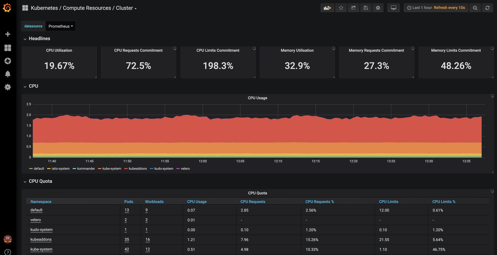

You can also access the Prometheus UI to see all the metrics available by clicking on the `Prometheus` icon on the Konvoy UI.

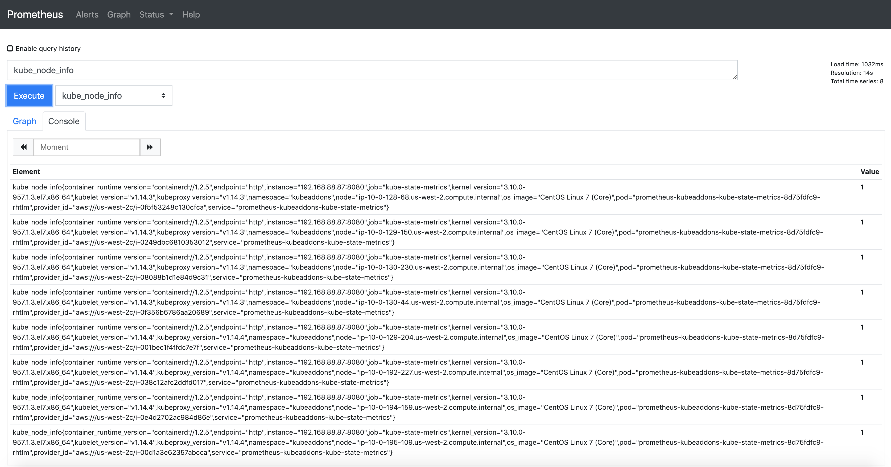

The KUDO Kafka operator comes by default the JMX Exporter agent enabled.

When Kafka operator deployed with parameter `METRICS_ENABLED=true` (which defaults to `true`) then:

- Each broker bootstraps with [JMX Exporter](https://github.com/prometheus/jmx_exporter) java agent exposing the metrics at `9094/metrics`
- Adds a port named `metrics` to the Kafka Service
- Adds a label `kubeaddons.mesosphere.io/servicemonitor: "true"` for the service monitor discovery.

Run the following command to enable Kafka metrics export:

```bash
kubectl create -f https://raw.githubusercontent.com/kudobuilder/operators/master/repository/kafka/docs/v0.1/resources/service-monitor.yaml
```

In the Grafana UI, click on the + sign on the left and select `Import`.

Copy the content of this [file](https://raw.githubusercontent.com/kudobuilder/operators/master/repository/kafka/docs/v0.1/resources/grafana-dashboard.json) as shown in the picture below.

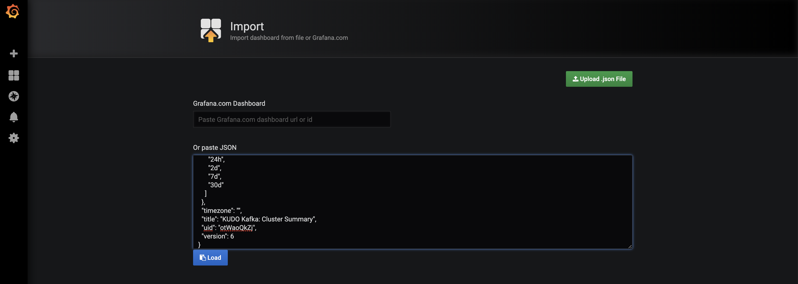

Click on `Load`.

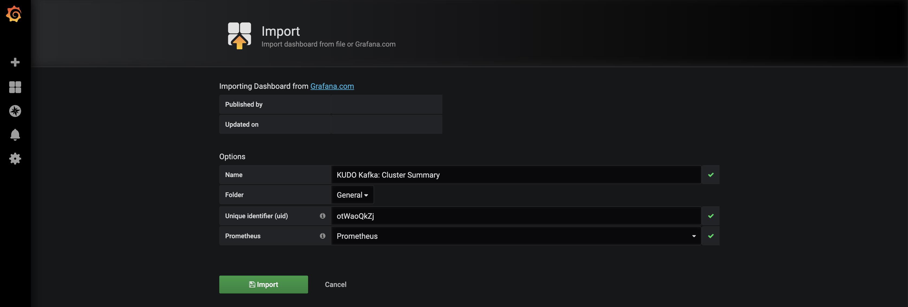

Select `Prometheus` in the `Prometheus` field and click on `Import`.

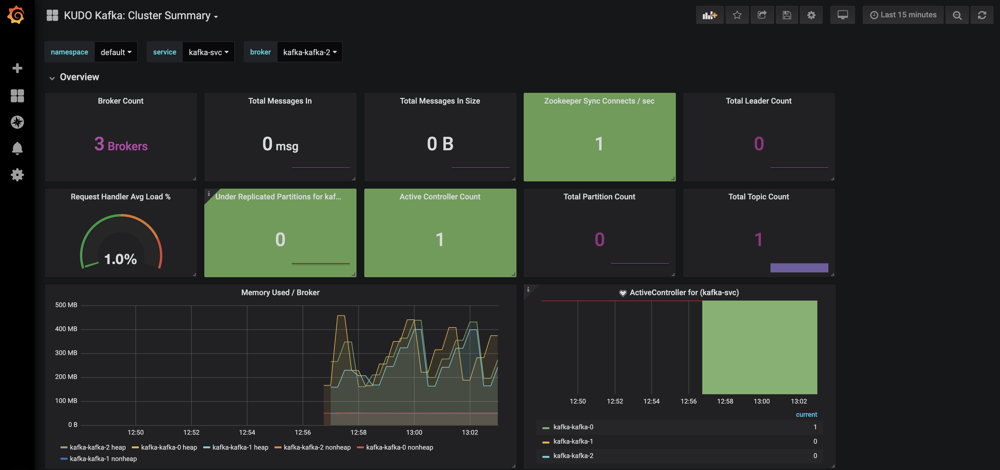

## 10. Konvoy logging/debugging

In Konvoy, all the logs are stored in an Elasticsearch cluster and exposed through Kibana.

To access the Kibana UI, click on the `Kibana Logs` icon on the Konvoy UI.

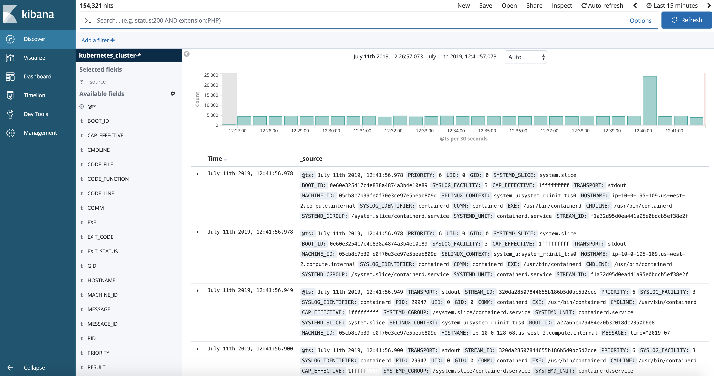

By default, it only shows the logs for the latest 15 minutes.

Click on the top right corner and select `Last 24 hours`.

Then, search for `redis`:

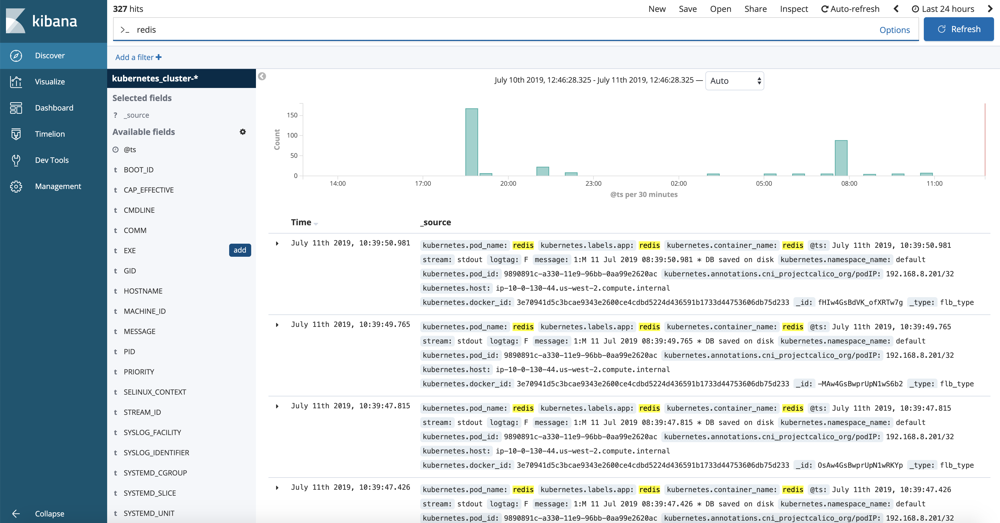

You'll see all the logs related to the redis Pod and Service you deployed previously.

### 10.1. Ingress troubleshooting.

In this section, we will leverage Konvoy logging to troubleshoot Ingress failure issue.

We will deploy a nginx application and expose it via L7 loadbalancer. The application can be accessed with URLs follows below patten.

`http[s]://$(kubectl get svc traefik-kubeaddons -n kubeaddons --output jsonpath="{.status.loadBalancer.ingress[*].hostname}")/applications/nginx/`

* 1st, let's deploy a nginx application and scale it to 3

```bash
kubectl run --image=nginx --replicas=3 --port=80 --restart=Always nginx
```
* 2nd, expose a in cluster service

```bash
kubectl expose deploy nginx --port 8080 --target-port 80 --type NodePort --name "svc-nginx"
```
* 3rd, create a ingress to expose service via Layer7 LB

```bash
cat << EOF | kubectl apply -f -
apiVersion: extensions/v1beta1
kind: Ingress
metadata:
  name: nginx-root
  namespace: default
spec:
  rules:
  - http:
      paths:
      - backend:
          serviceName: svc-nginx
          servicePort: 8080
        path:  /applications/nginx/
EOF
```
* 4th, Now check Ingress configure in Traefik

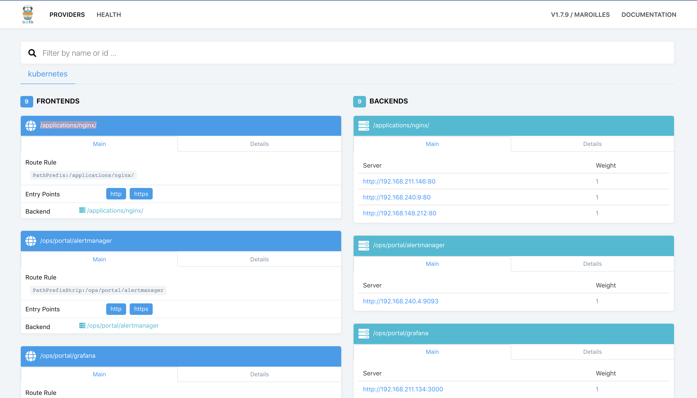

The `Traefik dashboard` indicates the nginx application is ready to receive traffic but if you try access nginx with URL listed below, you will notice `404 Not Found` error like:

```bash
curl -k https://$(kubectl get svc traefik-kubeaddons -n kubeaddons --output jsonpath="{.status.loadBalancer.ingress[*].hostname}")/applications/nginx/
```

Don't forget the trailing slash at the end of the URL. Otherwise, you won't generate a 404 error.

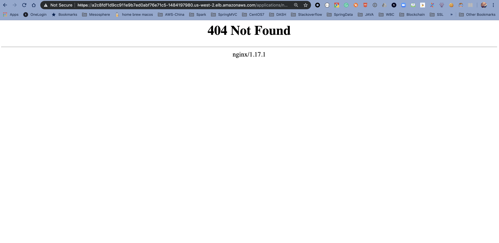

Let's troubleshoot this failure with Konvoy Kibana.

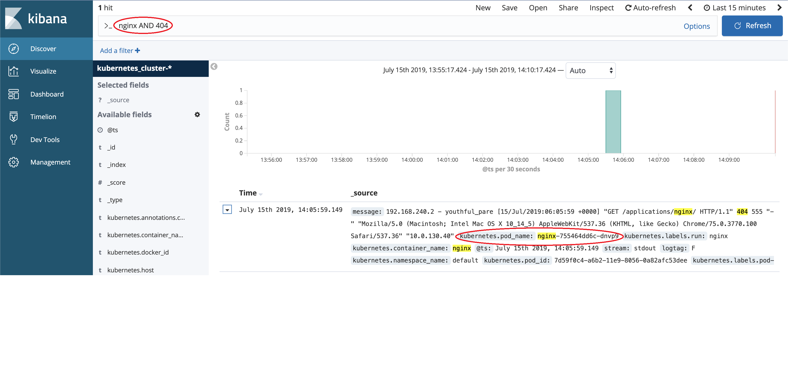

With Konvoy Kibana's near real time log collection and indexing, we can easily identify the ingress traffic was eventually handled by a pod `kubernetes.pod_name:nginx-755464dd6c-dnvp9` in nginx service. The log also gave us more information on the failure, `"GET /applications/nginx/ HTTP/1.1" 404`, which tell us that nginx can't find resource at path `/applications/nginx/`.

That is neat! Because w/o Kibana, you wouldn't know which Pod in our nginx service handles this request. (Our nginx deployment example launched 3 Pods to serve HTTP request) Not mention if there are multiple nginx service exists in the same K8s cluster but hosted at different namespace.

To fix this failure requires some knownledge on Nginx configuration. In general, when nginx is launched with default configuration, it serves a virtual directory on its `ROOT` path `(/)`. When receives HTTP requests, the nginx walk through its virtual directory to return back resources to the client.

In terms of out example, the `Ingress` configuration we submitted to k8s was configured to a path at `/applications/nginx/`. The `traefik` ingress controller sees this `Ingress configuration` and forwards any resource request at path `/applications/nginx/` to the down stream nginx service at the same path. The pod `kubernetes.pod_name:nginx-755464dd6c-dnvp9` received this request but nginx instance in this pod failed to locate any resource under path `/applications/nginx/`. That is the reason we saw this failure, `"GET /applications/nginx/ HTTP/1.1" 404`.  

You can, of course, configure nginx instance to serve resources at path `/applications/nginx/`. But an alternative solution is leverage `traefik` to strip PATH `/applications/nginx/` to `ROOT (/)` before route requests to nginx.

According to `Traefik` documentation [PathPrefixStrip](https://docs.traefik.io/configuration/backends/kubernetes/), the annotation `(traefik.ingress.kubernetes.io/rule-type)` is exactly what we need to direct traefik to strip ingress HOST PATH to ROOT PATH forementioned.

To update `Ingress`, we can use below command.

```bash
cat << EOF | kubectl apply -f -
apiVersion: extensions/v1beta1
kind: Ingress
metadata:
  annotations:
    traefik.frontend.rule.type: PathPrefixStrip
  name: nginx-root
  namespace: default
spec:
  rules:
  - http:
      paths:
      - backend:
          serviceName: svc-nginx
          servicePort: 8080
        path:  /applications/nginx/
EOF
```
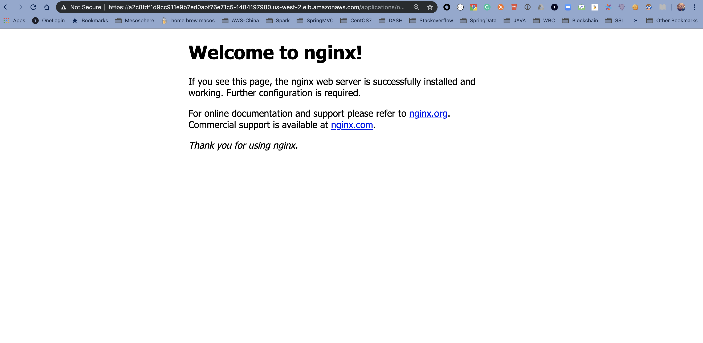

## 11. Upgrade a Konvoy cluster

Edit the `cluster.yaml` file to change the Kubernetes version from `1.15.2` to `1.15.3` in the 2 corresponding fields:
```
...
spec:
  kubernetes:
    version: 1.15.3
...
  - name: worker
  addons:
    configVersion: stable-1.15.3-0
...
```

```bash
konvoy up --yes --upgrade --force-upgrade
```

The output should be similar to:
```bash
This process will take about 15 minutes to complete (additional time may be required for larger clusters)

STAGE [Provisioning Infrastructure]

Initializing provider plugins...

Terraform has been successfully initialized!
Refreshing Terraform state in-memory prior to plan...
The refreshed state will be used to calculate this plan, but will not be
persisted to local or remote state storage.

random_id.id: Refreshing state... (ID: jKY)

...

No changes. Infrastructure is up-to-date.

This means that Terraform did not detect any differences between your
configuration and real physical resources that exist. As a result, no
actions need to be performed.

Apply complete! Resources: 0 added, 0 changed, 0 destroyed.

Outputs:

cluster_name = konvoy_v1.1.1-8ca6
vpc_id = vpc-0941bb098eb24080d

STAGE [Running Preflights]

...

STAGE [Determining Upgrade Safety]

ip-10-0-193-118.us-west-2.compute.internal                             [OK]
ip-10-0-193-232.us-west-2.compute.internal                             [OK]
ip-10-0-194-21.us-west-2.compute.internal                              [OK]
ip-10-0-128-239.us-west-2.compute.internal                             [WARNING]
  - All replicas of the ReplicaSet "default/nginx-7c45b84548" are running on this node.
ip-10-0-128-64.us-west-2.compute.internal                              [WARNING]
  - Pod "default/jenkins-c79f457cb-vrjjq" is using EmptyDir volume "plugins", which is unsafe for upgrades.
  - Pod "default/jenkins-c79f457cb-vrjjq" is using EmptyDir volume "tmp", which is unsafe for upgrades.
  - Pod "default/jenkins-c79f457cb-vrjjq" is using EmptyDir volume "plugin-dir", which is unsafe for upgrades.
  - Pod "default/jenkins-c79f457cb-vrjjq" is using EmptyDir volume "secrets-dir", which is unsafe for upgrades.
  - Pod "default/http-echo-2" is not being managed by a controller. Upgrading this node might result in data or availability loss.
  - Pod managed by ReplicaSet "default/jenkins-c79f457cb" is running on this node, and the ReplicaSet does not have a replica count greater than 1.
  - All replicas of the ReplicaSet "default/jenkins-c79f457cb" are running on this node.
  - Pod managed by ReplicaSet "default/kudo-kafka-generator-d655d6dff" is running on this node, and the ReplicaSet does not have a replica count greater than 1.
  - All replicas of the ReplicaSet "default/kudo-kafka-generator-d655d6dff" are running on this node.
ip-10-0-129-247.us-west-2.compute.internal                             [WARNING]
  - Pod "default/http-echo-1" is not being managed by a controller. Upgrading this node might result in data or availability loss.
  - Pod managed by StatefulSet "kudo-system/kudo-controller-manager" is running on this node, and the StatefulSet does not have a replica count greater than 1.
ip-10-0-129-41.us-west-2.compute.internal                              [OK]
ip-10-0-129-88.us-west-2.compute.internal                              [WARNING]
  - Pod managed by ReplicaSet "default/ebs-dynamic-app-68b598758" is running on this node, and the ReplicaSet does not have a replica count greater than 1.
  - All replicas of the ReplicaSet "default/ebs-dynamic-app-68b598758" are running on this node.
ip-10-0-130-84.us-west-2.compute.internal                              [WARNING]
  - Pod managed by ReplicaSet "default/kudo-kafka-consumer-6b4dd5cd59" is running on this node, and the ReplicaSet does not have a replica count greater than 1.
  - All replicas of the ReplicaSet "default/kudo-kafka-consumer-6b4dd5cd59" are running on this node.
  - Pod "default/redis" is not being managed by a controller. Upgrading this node might result in data or availability loss.

STAGE [Upgrading Kubernetes]

...

PLAY [Upgrade Nodes] ********************************************************************************************************************************************************************

...

TASK [kubeadm-upgrade-nodes : drain node] ***********************************************************************************************************************************************
changed: [10.0.129.184 -> ec2-54-191-70-155.us-west-2.compute.amazonaws.com]

...

STAGE [Deploying Enabled Addons]
helm                                                                   [OK]
dashboard                                                              [OK]
awsebscsiprovisioner                                                   [OK]
opsportal                                                              [OK]
fluentbit                                                              [OK]
traefik                                                                [OK]
kommander                                                              [OK]
elasticsearch                                                          [OK]
prometheus                                                             [OK]
traefik-forward-auth                                                   [OK]
dex                                                                    [OK]
prometheusadapter                                                      [OK]
kibana                                                                 [OK]
elasticsearchexporter                                                  [OK]
velero                                                                 [OK]
dex-k8s-authenticator                                                  [OK]

STAGE [Removing Disabled Addons]

Kubernetes cluster and addons deployed successfully!

Run `konvoy apply kubeconfig` to update kubectl credentials.

Navigate to the URL below to access various services running in the cluster.
  https://a1efd30f824244733adc1fb95157b9b1-2077667181.us-west-2.elb.amazonaws.com/ops/landing
And login using the credentials below.
  Username: angry_williams
  Password: TNFGnFrZjhqaF0SNLoCzN3gvqrEsviTYxvMyuPv8KHU13ob6eNa0N7LfSVhd07Xk

If the cluster was recently created, the dashboard and services may take a few minutes to be accessible.
```

If there is any error during the upgrade, run the `konvoy up --yes --upgrade --force-upgrade` again. It can happen when the `drain` command times out.

Without the `--force-upgrade` flag, the Kubernetes nodes that have under replicated pods wouldn't be upgraded.

Check the version of Kubernetes:

```bash
kubectl get nodes
```

The output should be similar to:
```bash
NAME                                         STATUS   ROLES    AGE   VERSION
ip-10-0-128-127.us-west-2.compute.internal   Ready    <none>   80m   v1.15.3
ip-10-0-129-21.us-west-2.compute.internal    Ready    <none>   80m   v1.15.3
ip-10-0-129-33.us-west-2.compute.internal    Ready    <none>   36m   v1.15.3
ip-10-0-130-39.us-west-2.compute.internal    Ready    <none>   80m   v1.15.3
ip-10-0-131-155.us-west-2.compute.internal   Ready    <none>   80m   v1.15.3
ip-10-0-131-252.us-west-2.compute.internal   Ready    <none>   80m   v1.15.3
ip-10-0-194-48.us-west-2.compute.internal    Ready    master   82m   v1.15.3
ip-10-0-194-91.us-west-2.compute.internal    Ready    master   81m   v1.15.3
ip-10-0-195-21.us-west-2.compute.internal    Ready    master   82m   v1.15.3
```

Check that the `Jenkins` and the `ebs-dynamic-app` apps are still accessible.

The `Redis` and the `http-echo` apps aren't running anymore as they haven't been deployed using a `deployment`.

## 12. Destroy a Konvoy cluster

When you run konvoy down, the command removes all of the AWS infrastructure resources create for the cluster, including any volumes that are backing PersistentVolumesClaims with a Delete ReclaimPolicy.

To completely remove Konvoy cluster resources:

Change to the directory that contains your cluster’s state files, then run the following command:
```
konvoy down --yes
```
The konvoy down command then begins removing cluster resources by deleting load balancers, security groups and volumes. It deletes these resources using the AWS API to ensure they are deleted quickly.

After konvoy down removes these resources, it uses Terraform to delete the resources created by the konvoy up command and Terraform provisioning.


## Appendix 1. Setting up an external identity provider

Your Konvoy cluster contains a Dex instance which serves as an identity broker and allows you to integrate with Google's OAuth.

Google's OAuth 2.0 APIs can be used for both authentication and authorization.

Go to [Google’s developer console](https://console.developers.google.com/) and create a project.

Select that project.

In the Credentials tab of that project start with setting up the OAuth consent screen.

Indicate an `Application name` and add the DNS name via which your Konvoy cluster is publicly reachable (`<public-cluster-dns-name>`) into `Authorized domains`.

Save the OAuth consent screen configuration.

Press Create credentials, select OAuth client ID, and then Web application.

Under Authorized redirect URIs insert `https://<public-cluster-dns-name>/dex/callback`.

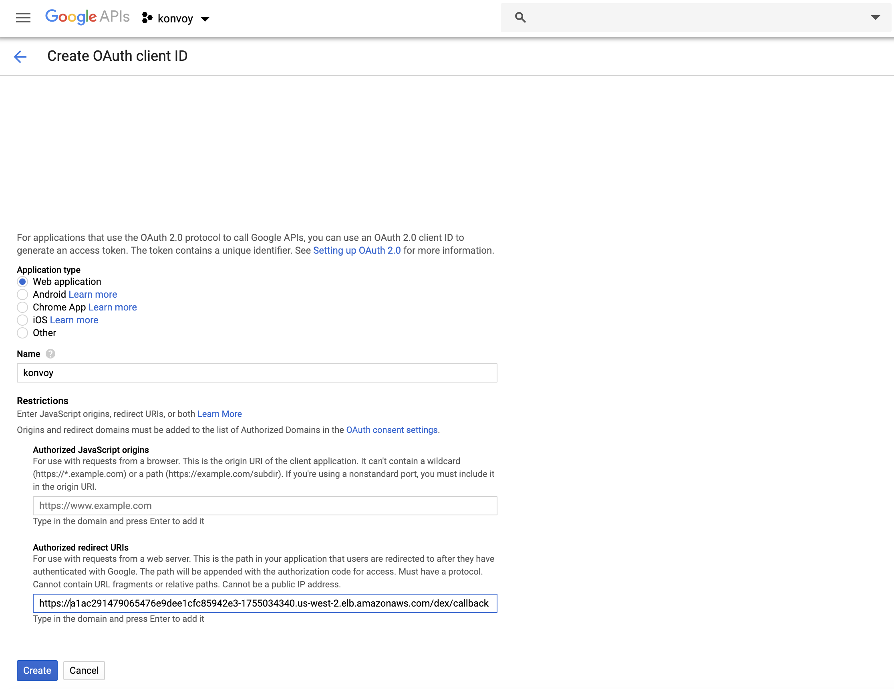

Don't forget to hit ENTER when setting up oauth in the google console for the redirect url and other fields, otherwise the values are not saved if you just hit the save button.

Save the configuration and note down the client ID and the client secret.

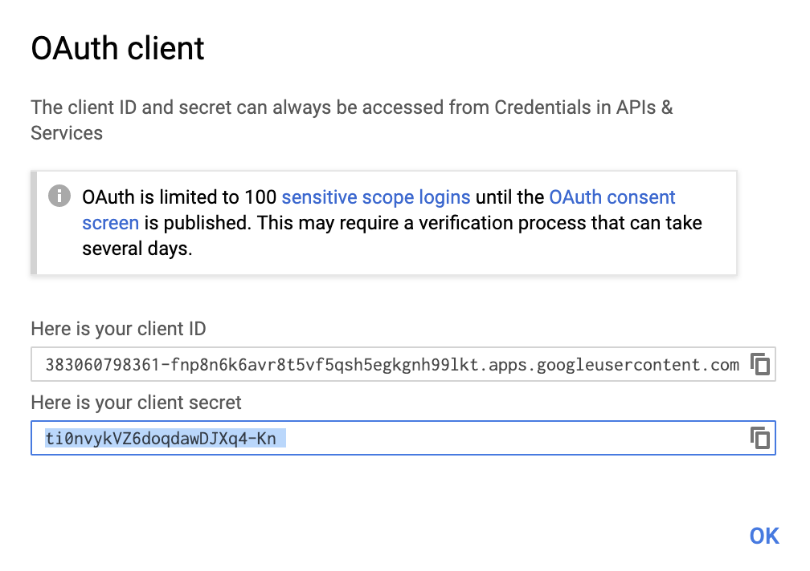

Run the following command (after inserting your email address) to provide admin rights to your Google account:

```bash
cat <<EOF | kubectl create -f -
kind: ClusterRoleBinding
apiVersion: rbac.authorization.k8s.io/v1
metadata:
  name: admin-binding
subjects:
- kind: User
  name: <your Google email>
roleRef:
  kind: ClusterRole
  name: cluster-admin
  apiGroup: rbac.authorization.k8s.io
EOF
```


Edit the `cluster.yaml` file and update the `dex` section as below:

```
    - name: dex
      enabled: true
      values: |
        config:
          connectors:
          - type: oidc
            id: google
            name: Google Accounts
            config:
              issuer: https://accounts.google.com
              clientID: <client ID>
              clientSecret: <client secret>
              redirectURI: https://<public-cluster-dns-name>/dex/callback
              userIDKey: email
              userNameKey: email
```

And run `konvoy up --yes` again to apply the change.

When the update is finished, Go to `https://<public-cluster-dns-name>/token` and login with your Google Account.

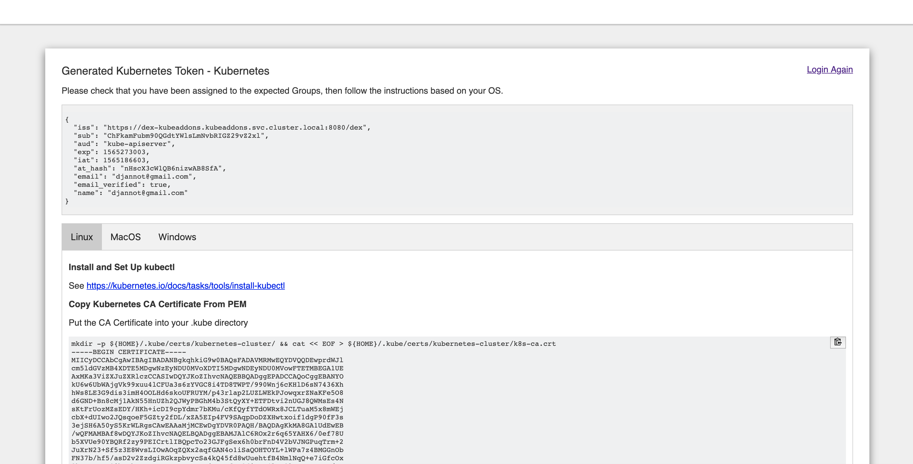

Follow the instructions in the page, but use the command below in the second step to get the right value for the `server` parameter:

```bash
kubectl config set-cluster kubernetes-cluster \
    --certificate-authority=${HOME}/.kube/certs/kubernetes-cluster/k8s-ca.crt \
    --server=$(kubectl config view | grep server | awk '{ print $2 }')
```

Run the following command to check that you can administer the Kubernetes cluster with your Google account:

```bash
kubectl get nodes
```
